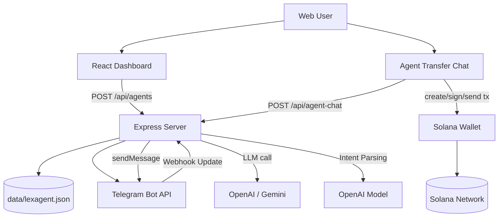

# Lexagent

Lexagent is a web application to create **Telegram-based AI Agents** connected to a user wallet, plus an **Agent Transfer Chat** mode that translates natural language instructions into SOL transfer actions (with wallet signature approval).

## Key Features

- **Agent Factory**: create and deploy Telegram agents per wallet.
- **Flexible LLM providers**: Gemini / OpenAI (Anthropic is available in UI and can be completed in backend).
- **Telegram webhook runtime**: incoming messages are processed through a webhook endpoint.
- **Custom system prompts**: each agent can have its own behavior/personality.
- **Agent Transfer Chat**: transfer-intent parsing via `/api/agent-chat`.
- **Wallet-gated access**: agent creation is available only when a wallet is connected.

---

## Tech Stack

- **Frontend**: React 19 + Vite + TypeScript + Tailwind
- **Backend**: Express + TypeScript (`server.ts`)
- **AI SDKs**: `@google/genai`, `openai`
- **Bot integration**: `node-telegram-bot-api`
- **Blockchain**: `@solana/web3.js`
- **Storage**: local JSON file (`data/lexagent.json`)

---

## Local Setup

### 1) Prerequisites

- Node.js 20+
- npm

### 2) Install dependencies

```bash
npm install
```

### 3) Configure environment

Copy `.env.example` to `.env`, then fill in your values:

```bash
cp .env.example .env
```

Minimum required values:

- `OPENAI_API_KEY` → used by `/api/agent-chat`
- `APP_URL` → your public app URL (required for Telegram webhook in deployed env)
- `GEMINI_API_KEY` → required if you use Gemini-based flow

### 4) Run development mode

```bash
npm run dev
```

This runs:
- Vite dev server (frontend)
- proxy/runtime helper (`proxy-dev.cjs`) based on project config

### 5) Type-check

```bash
npm run lint
```

### 6) Production build

```bash
npm run build
```

---

## How It Works

### A. Agent Deployment (Dashboard → CreateAgent)

1. User connects wallet.
2. User submits:
   - agent name,
   - Telegram bot token,
   - LLM provider + API key,
   - system prompt,
   - optional allowed chat ID.
3. Frontend sends `POST /api/agents`.
4. Server validates bot token (`getMe`) and sets webhook to:
   - `/api/telegram/webhook/:token`
5. Agent data is stored in JSON DB (`data/lexagent.json`).
6. Agent is ready to receive Telegram messages.

### B. Telegram Runtime Chat

1. Telegram sends update to webhook.
2. Server resolves agent by token.
3. (Optional) server validates `allowed_chat_id`.
4. Server forwards message text to configured LLM provider.
5. LLM response is sent back to Telegram chat.

### C. Agent Transfer Chat (In-App)

1. User sends natural language instruction (e.g. `send 0.1 SOL to ...`).
2. Frontend calls `POST /api/agent-chat`.
3. Endpoint asks OpenAI model to map instruction into JSON schema:
   - `intent`, `amountSol`, `toAddress`, `reply`.
4. If `intent=send_sol` and fields are complete:
   - frontend builds Solana transaction,
   - user wallet signs and sends transaction.
5. UI displays result and transaction signature.

---

## Architecture Diagram



---

## Project Structure (Brief)

```text
Lexagent/
├─ api/
│  └─ agent-chat.ts              # Alternative API route (serverless style)
├─ src/
│  ├─ pages/
│  │  ├─ CreateAgent.tsx         # Agent deployment UI
│  │  └─ AgentTransferChat.tsx   # Transfer-via-chat UI
│  ├─ db/index.ts                # JSON DB adapter
│  ├─ lib/solana.ts              # SOL transaction helper
│  └─ ...
├─ server.ts                     # Main Express server
├─ proxy-dev.cjs                 # Dev proxy/runtime helper
├─ .env.example
└─ package.json
```

---

## API Endpoints (Current)

### `GET /api/agents?walletAddress=...`
Returns agent list by wallet address.

### `POST /api/agents`
Creates a new agent and sets Telegram webhook.

Example body:

```json
{
  "walletAddress": "...",
  "name": "LexagentBot_01",
  "telegramToken": "123:abc",
  "allowedChatId": "123456789",
  "llmProvider": "gemini",
  "llmApiKey": "...",
  "systemPrompt": "You are a helpful AI agent"
}
```

### `POST /api/telegram/webhook/:token`
Telegram webhook receiver endpoint.

### `POST /api/agent-chat`
Parses user instruction into transfer/chat intent JSON.

Example body:

```json
{
  "message": "send 0.1 SOL to <wallet_address>"
}
```

---

## Important Notes (Current Limitations)

- Credentials are currently stored in local JSON (not encrypted).
- Wallet ownership verification for agent creation can be strengthened (challenge-signature).
- Webhook endpoint currently uses token in path (needs production hardening).
- Current `node-telegram-bot-api` dependency chain still includes older transitive packages.

---

## Production Hardening Recommendations

- Move secrets to a proper secret manager/KMS (no plaintext storage).
- Implement wallet signature authentication (nonce + verification).
- Replace token-based webhook path with internal ID + signature validation.
- Add rate limiting and log redaction for tokens/API keys.
- Audit and upgrade vulnerable dependencies regularly.

---

## License

Not specified yet. Add a `LICENSE` file based on your preferred license model.
