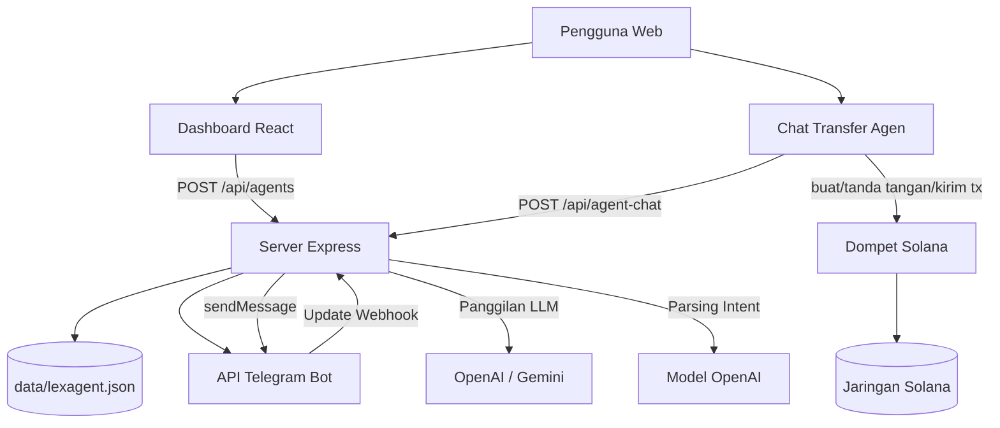

# Lexagent

Lexagent adalah aplikasi web untuk membuat **Agen AI berbasis Telegram** yang terhubung ke dompet pengguna, plus mode **Chat Transfer Agen** untuk menerjemahkan instruksi bahasa natural menjadi aksi transfer SOL (tetap dengan persetujuan tanda tangan dompet).

## Ringkasan Fitur

- **Pabrik Agen**: membuat dan menerapkan agen Telegram per dompet.
- **Penyedia LLM fleksibel**: Gemini / OpenAI (Anthropic sudah ada di UI, implementasi backend bisa dilanjutkan).
- **Webhook Telegram**: pesan masuk diproses lewat endpoint webhook.
- **Prompt sistem kustom**: tiap agen punya kepribadian/instruksi sendiri.
- **Chat Transfer Agen**: parsing intent transfer SOL melalui endpoint `/api/agent-chat`.
- **Akses berbasis dompet**: pembuatan agen hanya saat dompet terkoneksi.

---

## Tumpukan Teknologi

- **Frontend**: React 19 + Vite + TypeScript + Tailwind
- **Backend**: Express + TypeScript (`server.ts`)
- **SDK AI**: `@google/genai`, `openai`
- **Bot**: `node-telegram-bot-api`
- **Blockchain**: `@solana/web3.js`
- **Penyimpanan**: berkas JSON lokal (`data/lexagent.json`)

---

## Cara Menjalankan Secara Lokal

### 1) Prasyarat

- Node.js 20+
- npm

### 2) Pasang dependensi

```bash
npm install
```

### 3) Atur environment

Salin `.env.example` menjadi `.env` lalu isi nilainya:

```bash
cp .env.example .env
```

Minimal yang perlu diisi:

- `OPENAI_API_KEY` → untuk endpoint `/api/agent-chat`
- `APP_URL` → URL publik aplikasi (wajib untuk webhook Telegram saat deploy)
- `GEMINI_API_KEY` → jika memakai Gemini pada alur terkait

### 4) Jalankan mode pengembangan

```bash
npm run dev
```

Aplikasi akan menjalankan:
- server Vite (frontend)
- proxy server (`proxy-dev.cjs`) sesuai konfigurasi proyek

### 5) Cek tipe TypeScript

```bash
npm run lint
```

### 6) Build produksi

```bash
npm run build
```

---

## Cara Kerja Sistem

### A. Menerapkan Agen (Dashboard → CreateAgent)

1. Pengguna menghubungkan dompet.
2. Pengguna mengisi:
   - nama agen,
   - token bot Telegram,
   - penyedia LLM + API key,
   - prompt sistem,
   - opsional `allowedChatId`.
3. Frontend memanggil `POST /api/agents`.
4. Server memvalidasi token bot (`getMe`) lalu mengatur webhook ke:
   - `/api/telegram/webhook/:token`
5. Data agen disimpan ke DB JSON (`data/lexagent.json`).
6. Agen siap menerima chat di Telegram.

### B. Alur Chat Telegram Saat Berjalan

1. Telegram mengirim update ke webhook.
2. Server mencari agen berdasarkan token.
3. (Opsional) server memvalidasi `allowed_chat_id`.
4. Server meneruskan teks ke penyedia LLM sesuai konfigurasi agen.
5. Jawaban LLM dikirim kembali ke chat Telegram.

### C. Chat Transfer Agen (Di Dalam Aplikasi)

1. Pengguna menulis instruksi natural language (contoh: “send 0.1 SOL to ...”).
2. Frontend memanggil `POST /api/agent-chat`.
3. Endpoint meminta model OpenAI memetakan instruksi ke skema JSON:
   - `intent`, `amountSol`, `toAddress`, `reply`.
4. Jika `intent=send_sol` dan parameter lengkap:
   - frontend membuat transaksi Solana,
   - dompet pengguna menandatangani dan mengirim transaksi.
5. UI menampilkan hasil/signature transaksi.

---

## Bagan Arsitektur



---

## Struktur Proyek (Ringkas)

```text
Lexagent/
├─ api/
│  └─ agent-chat.ts              # Rute API alternatif (gaya serverless)
├─ src/
│  ├─ pages/
│  │  ├─ CreateAgent.tsx         # UI penerapan agen
│  │  └─ AgentTransferChat.tsx   # UI transfer lewat chat
│  ├─ db/index.ts                # adaptor DB JSON
│  ├─ lib/solana.ts              # helper transaksi SOL
│  └─ ...
├─ server.ts                     # server Express utama
├─ proxy-dev.cjs                 # helper proxy/runtime pengembangan
├─ .env.example
└─ package.json
```

---

## Endpoint API (Saat Ini)

### `GET /api/agents?walletAddress=...`
Mengambil daftar agen berdasarkan alamat dompet.

### `POST /api/agents`
Membuat agen baru sekaligus mengatur webhook Telegram.

Contoh body:

```json
{
  "walletAddress": "...",
  "name": "LexagentBot_01",
  "telegramToken": "123:abc",
  "allowedChatId": "123456789",
  "llmProvider": "gemini",
  "llmApiKey": "...",
  "systemPrompt": "Kamu adalah agen AI yang membantu"
}
```

### `POST /api/telegram/webhook/:token`
Penerima webhook dari Telegram.

### `POST /api/agent-chat`
Menerjemahkan instruksi pengguna menjadi intent JSON transfer/chat.

Contoh body:

```json
{
  "message": "send 0.1 SOL to <wallet_address>"
}
```

---

## Catatan Penting (Keterbatasan Saat Ini)

- Penyimpanan kredensial masih di berkas JSON lokal (belum terenkripsi).
- Verifikasi kepemilikan dompet saat membuat agen masih dapat diperketat (challenge-signature).
- Endpoint webhook masih memakai token di path (perlu hardening tambahan untuk produksi).
- Rantai dependensi `node-telegram-bot-api` saat ini masih menarik paket transitive lama yang rentan.

---

## Rekomendasi Penguatan Produksi

- Simpan rahasia di secret manager/KMS, bukan berkas plaintext.
- Implementasikan autentikasi tanda tangan dompet (nonce + verifikasi).
- Ganti path webhook berbasis ID internal + validasi signature header.
- Tambahkan rate limit dan redaksi log untuk token/API key.
- Audit dan upgrade dependensi rentan secara berkala.

---

## Lisensi

Belum ditentukan. Tambahkan berkas `LICENSE` sesuai kebutuhan proyek.
