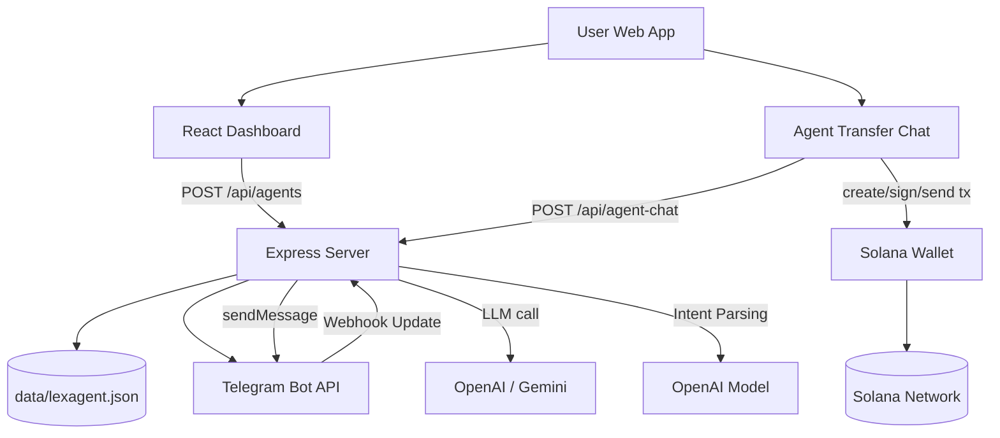

# Lexagent

Lexagent adalah web app untuk membuat **AI Agent berbasis Telegram** yang terhubung ke wallet user, plus mode **Agent Transfer Chat** untuk interpretasi instruksi natural language menjadi aksi transfer SOL (dengan approval wallet).

## Fitur Utama

- **Agent Factory**: deploy agent Telegram per wallet.
- **LLM provider fleksibel**: Gemini / OpenAI (Anthropic disiapkan di UI, implementasi backend bisa dilanjutkan).
- **Telegram webhook**: pesan masuk diproses via endpoint webhook.
- **Prompt kustom**: tiap agent bisa punya system prompt sendiri.
- **Agent Transfer Chat**: parsing intent transfer SOL dari bahasa natural via endpoint `/api/agent-chat`.
- **Wallet-gated UI**: pembuatan agent hanya saat wallet terkoneksi.

---

## Tech Stack

- **Frontend**: React 19 + Vite + TypeScript + Tailwind
- **Backend**: Express + TypeScript (`server.ts`)
- **AI SDK**: `@google/genai`, `openai`
- **Bot**: `node-telegram-bot-api`
- **Blockchain**: `@solana/web3.js`
- **Storage**: JSON file lokal (`data/lexagent.json`)

---

## Cara Menjalankan (Local)

### 1) Prasyarat

- Node.js 20+
- npm

### 2) Install dependency

```bash
npm install
```

### 3) Setup environment

Copy `.env.example` menjadi `.env` lalu isi value:

```bash
cp .env.example .env
```

Minimal yang perlu:

- `OPENAI_API_KEY` → untuk endpoint `/api/agent-chat`
- `APP_URL` → URL publik app kamu (wajib untuk Telegram webhook di environment deploy)
- `GEMINI_API_KEY` → jika pakai Gemini global (opsional untuk alur tertentu)

### 4) Jalankan mode development

```bash
npm run dev
```

Aplikasi akan menjalankan:
- Vite dev server (frontend)
- proxy server (`proxy-dev.cjs`) sesuai konfigurasi project

### 5) Typecheck

```bash
npm run lint
```

### 6) Build production

```bash
npm run build
```

---

## How It Works

### A. Deploy Agent (Dashboard → CreateAgent)

1. User connect wallet.
2. User isi:
   - nama agent,
   - token Telegram bot,
   - provider LLM + API key,
   - system prompt,
   - optional allowed chat ID.
3. Frontend `POST /api/agents`.
4. Server validasi token bot (`getMe`) lalu set webhook ke:
   - `/api/telegram/webhook/:token`
5. Data agent disimpan ke DB JSON (`data/lexagent.json`).
6. Agent siap menerima chat di Telegram.

### B. Runtime Chat Telegram

1. Telegram kirim update ke webhook.
2. Server cari agent berdasarkan token.
3. (Opsional) validasi `allowed_chat_id`.
4. Server forward text ke provider LLM sesuai konfigurasi agent.
5. Response LLM dikirim balik ke chat Telegram.

### C. Agent Transfer Chat (In-app)

1. User ketik instruksi natural language (mis. “send 0.1 SOL to ...”).
2. Frontend panggil `POST /api/agent-chat`.
3. Endpoint minta model OpenAI parse intent ke JSON schema:
   - `intent`, `amountSol`, `toAddress`, `reply`.
4. Jika `intent=send_sol` + parameter lengkap:
   - frontend create transaksi Solana,
   - wallet user sign & send.
5. UI tampilkan hasil/signature transaksi.

---

## Bagan Arsitektur



---

## Struktur Proyek (Ringkas)

```text
Lexagent/
├─ api/
│  └─ agent-chat.ts              # API route alternatif (serverless style)
├─ src/
│  ├─ pages/
│  │  ├─ CreateAgent.tsx         # UI deploy agent
│  │  └─ AgentTransferChat.tsx   # UI transfer via chat
│  ├─ db/index.ts                # JSON DB adapter
│  ├─ lib/solana.ts              # helper transaksi SOL
│  └─ ...
├─ server.ts                     # Express server utama
├─ proxy-dev.cjs                 # dev proxy/runtime helper
├─ .env.example
└─ package.json
```

---

## API Endpoints (Saat Ini)

### `GET /api/agents?walletAddress=...`
Ambil daftar agent berdasarkan wallet.

### `POST /api/agents`
Buat agent baru + setup Telegram webhook.

Body contoh:

```json
{
  "walletAddress": "...",
  "name": "LexagentBot_01",
  "telegramToken": "123:abc",
  "allowedChatId": "123456789",
  "llmProvider": "gemini",
  "llmApiKey": "...",
  "systemPrompt": "You are a helpful AI agent"
}
```

### `POST /api/telegram/webhook/:token`
Webhook receiver dari Telegram.

### `POST /api/agent-chat`
Parse instruksi user jadi intent JSON transfer/chat.

Body contoh:

```json
{
  "message": "send 0.1 SOL to <wallet_address>"
}
```

---

## Catatan Penting (Current Limitations)

- Storage kredensial saat ini masih di file JSON lokal (belum encrypted).
- Wallet ownership verification untuk create agent masih bisa diperketat (challenge-signature).
- Endpoint webhook masih pakai token di path (perlu hardening tambahan untuk production).
- `node-telegram-bot-api` dependency chain saat ini punya vulnerability dari paket transitive lama.

---

## Rekomendasi Production Hardening

- Simpan secret di secret manager/KMS, bukan plaintext file.
- Implement wallet signature auth (nonce + verify).
- Ganti webhook path berbasis internal ID + signature validation.
- Tambah rate limiting + log redaction.
- Audit dan upgrade dependency rentan.

---

## License

Belum ditentukan. Tambahkan file `LICENSE` sesuai kebutuhan proyek.
