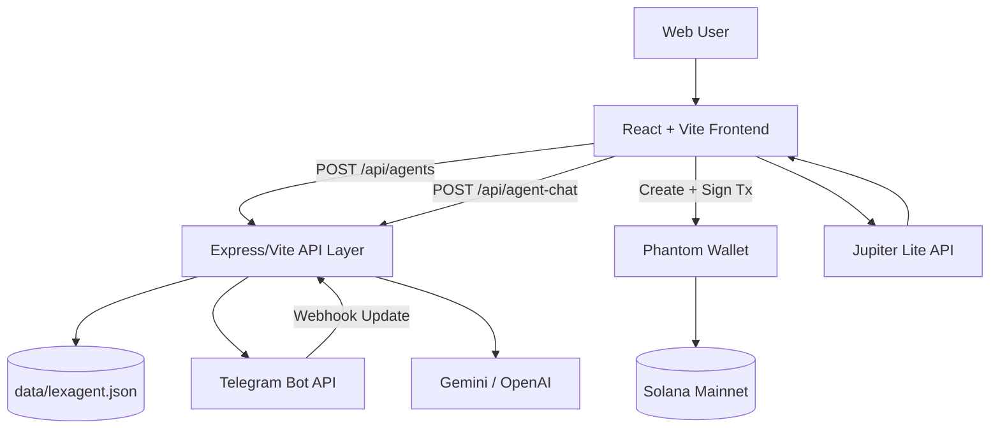
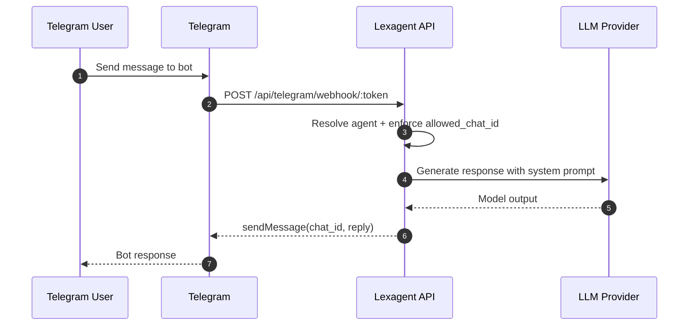
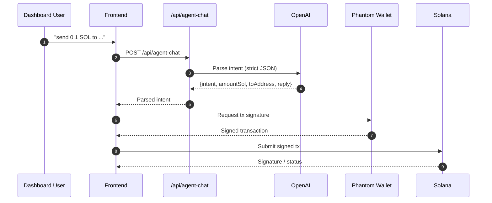

# Lexagent ⚡

**Telegram-native AI agents with wallet-connected Solana execution.**

Lexagent is a full-stack application for deploying AI agents to Telegram and executing on-chain actions from natural language—while keeping wallet signature control in the user’s hands.

---

## TL;DR

Lexagent lets users:
- deploy custom AI Telegram bots,
- parse chat intent into structured transfer actions,
- execute Solana transactions via connected wallet,
- monitor balance/history/swap flows from a dashboard.

---

## Why Lexagent

Most crypto workflows are still manual: open wallet → copy address → switch tabs → confirm tx → repeat.

Lexagent reduces that friction by combining:
- **LLM-driven intent parsing** (chat → structured action),
- **Telegram bot runtime automation**,
- **wallet-signed Solana execution** (non-custodial control).

---

## Core Capabilities

### 1) Agent Factory (Telegram AI Agent Deployment)
Create per-wallet Telegram agents with:
- custom bot token,
- custom system prompt,
- selectable LLM provider (Gemini / OpenAI; Anthropic option appears in UI).

### 2) Agent Transfer Chat (Natural Language → SOL Transfer)
Example input:

```txt
send 0.1 SOL to <wallet_address>
```

Backend normalizes this into strict JSON intent. Frontend then builds a Solana transaction for wallet signature.

### 3) Solana Dashboard
- live SOL balance,
- SOL/USD price,
- recent on-chain activity,
- explorer links.

### 4) Private Transfer via Claim Code
Send SOL to a temporary pool and share a claim code with the recipient.

### 5) Swap (Jupiter Lite API)
Token swap flow for SOL / USDC / USDT using Jupiter quote + swap APIs.

---

## End-to-End Product Flows

### A) Deploying a Telegram Agent
1. User connects wallet.
2. User submits config (`name`, `telegramToken`, `llmProvider`, `llmApiKey`, `systemPrompt`, optional `allowedChatId`).
3. `POST /api/agents` validates Telegram token via `getMe()`.
4. Server sets webhook to `/api/telegram/webhook/:token`.
5. Agent config is persisted to JSON DB (`data/lexagent.json`).

### B) Telegram Runtime
1. Telegram sends update to webhook endpoint.
2. Server resolves the agent from token.
3. Optional chat restriction via `allowed_chat_id`.
4. Message is forwarded to configured LLM provider.
5. Model response is returned to Telegram chat.

### C) Agent Transfer Chat Runtime
1. User sends command in app (`/dashboard/agent-transfer`).
2. Frontend calls `POST /api/agent-chat`.
3. OpenAI model returns strict schema:
   - `intent`: `send_sol | chat`
   - `amountSol`
   - `toAddress`
   - `reply`
4. If `intent=send_sol`, app builds tx and requests Phantom signature.
5. Signed tx is submitted to Solana.

---

## System Architecture



---

## Sequence Diagram — Telegram Agent Runtime



---

## Sequence Diagram — Agent Transfer Chat



---

## Tech Stack

### Frontend
- React 19
- TypeScript
- Vite 6
- Tailwind CSS v4
- Motion + Lucide icons

### Backend
- Express (`server.ts`)
- Vite middleware API plugin for dev (`vite.config.ts`)
- Node Telegram Bot API

### Blockchain / Infra
- `@solana/web3.js`
- Phantom wallet integration
- Jupiter Lite API (swap routing)
- CoinGecko (SOL price feed)

### Data
- Local JSON storage (`data/lexagent.json`)

---

## Repository Structure

```text
Lexagent/
├─ api/
│  └─ agent-chat.ts                # Serverless-style route variant
├─ public/                         # Static assets
├─ src/
│  ├─ components/                  # Landing + shared UI components
│  ├─ context/WalletContext.tsx    # Wallet connect + sign/send abstraction
│  ├─ db/index.ts                  # JSON DB adapter
│  ├─ lib/solana.ts                # Solana ops (balance, tx, pool claim, etc.)
│  ├─ layouts/DashboardLayout.tsx
│  ├─ pages/
│  │  ├─ DashboardHome.tsx
│  │  ├─ Transfer.tsx
│  │  ├─ Swap.tsx
│  │  ├─ History.tsx
│  │  ├─ Settings.tsx
│  │  ├─ CreateAgent.tsx
│  │  └─ AgentTransferChat.tsx
│  └─ App.tsx
├─ server.ts                       # Production server
├─ vite.config.ts                  # Vite + dev API middleware
├─ proxy-dev.cjs                   # Local proxy helper
├─ .env.example
└─ package.json
```

---

## API Reference

### `GET /api/agents?walletAddress=<address>`
Returns all agents linked to a wallet.

### `POST /api/agents`
Creates a new Telegram agent and registers webhook.

Example payload:

```json
{
  "walletAddress": "<wallet>",
  "name": "LexagentBot_01",
  "telegramToken": "123456:ABC...",
  "allowedChatId": "123456789",
  "llmProvider": "gemini",
  "llmApiKey": "<provider-key>",
  "systemPrompt": "You are a helpful AI agent"
}
```

### `POST /api/telegram/webhook/:token`
Telegram webhook receiver for deployed agents.

### `POST /api/agent-chat`
Converts natural language into transfer/chat intent.

Example payload:

```json
{
  "message": "send 0.1 SOL to <wallet_address>"
}
```

---

## Environment Variables

Create `.env` from `.env.example`:

```bash
cp .env.example .env
```

Common variables:
- `OPENAI_API_KEY` — required for `/api/agent-chat`
- `APP_URL` — public app URL used for Telegram webhook registration
- `GEMINI_API_KEY` — required for Gemini-based provider flow

---

## Local Development

```bash
npm install
npm run dev
```

Lint:

```bash
npm run lint
```

Build:

```bash
npm run build
```

---

## Security Notes / Current Limitations

- Secrets (`telegram_token`, `llm_api_key`) are currently stored in local JSON (plaintext).
- Webhook endpoint currently uses token in URL path.
- Wallet ownership verification is not yet challenge-signature based for agent creation.
- Some transitive Telegram-chain dependencies are outdated.

---

## Production Hardening Recommendations

1. Move credentials to a Secret Manager / KMS.
2. Add wallet-signature auth (`nonce + verify`) for ownership proof.
3. Replace tokenized webhook path with internal ID + request signature verification.
4. Add request rate limits and structured log redaction.
5. Enforce CI checks: SAST, dependency audit, and typed API contract tests.

---

## Roadmap

- [ ] Authenticated agent ownership proof (wallet signature)
- [ ] Encrypted credential storage
- [ ] Provider parity (Anthropic backend path)
- [ ] Multi-chain architecture abstraction
- [ ] Team/org-level agent management
- [ ] Observability (metrics, traces, structured logs)

---

## Social

- X: <https://x.com/LexagentHQ>
- Telegram: <https://t.me/+M7MCtK3iDdszYzll>
- GitHub: <https://github.com/lexagentHQ/LexagentHQ>

---

## License

Not specified yet. Add a `LICENSE` file with your preferred model.
